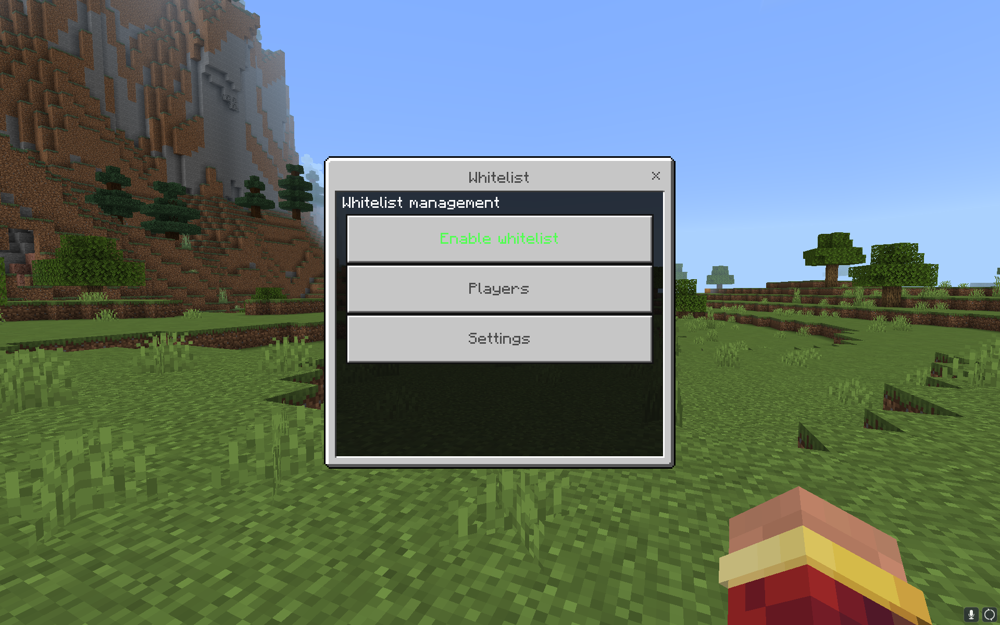
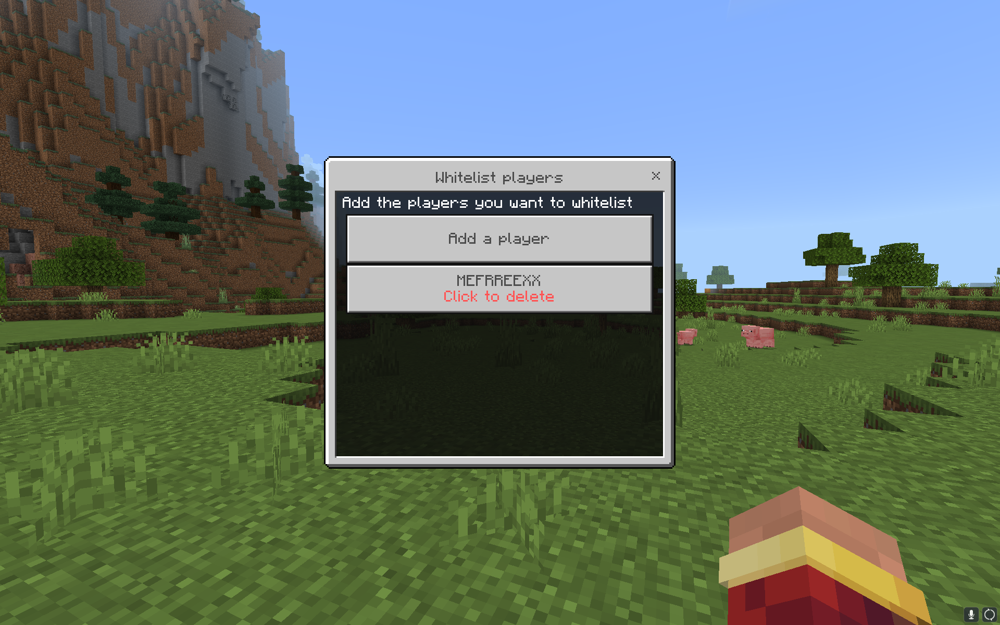
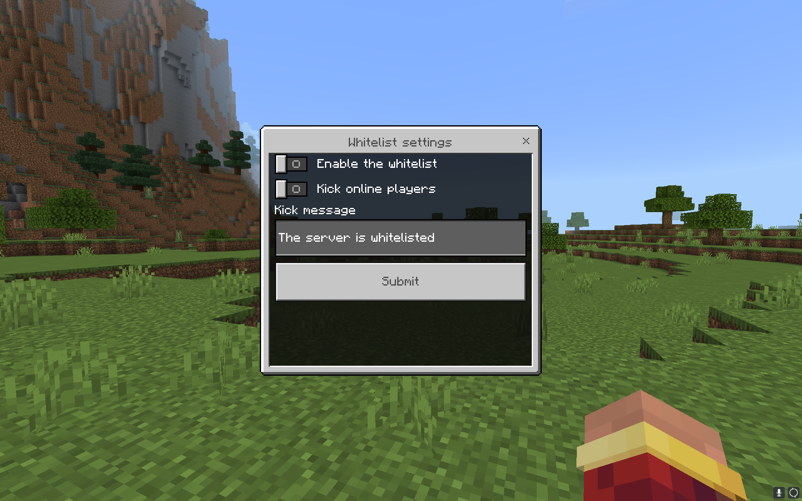

# Whitelister
Advanced whitelist plugin for Nukkit and PowerNukkitX

## 🤔 Introduction

The plugin is designed to make the whitelist easier to work with and provides a number of features over the standard whitelist:
- Configuring the whitelist in forms
- Configuring the whitelist via commands
- Configuring all messages in a specific file
- Setting that allows to kick all players when whitelist is enabled
- Json, SQLite3 and MySQL support
- English, Russian language support

## 📷 Screenshots

## 💻 Commands
| Name           | Description         |
|----------------|---------------------|
| /whitelister   | Plugin main command |

## 🔒 Permissions
| Name                            | Description                                                      |
|---------------------------------|------------------------------------------------------------------|
| whitelister.command.whitelister | Allows the player to use the /whitelister command                |
| whitelister.bypass              | Allows a player to join a whitelisted server without being on it |

## 📋 Events
| Name                        | Cancellable | Description                                                    |
|-----------------------------|-------------|----------------------------------------------------------------|
| WhitelistKickPlayerEvent    | true        | Called when a player is kicked from the server by a whitelist  |

## 🔌 Installation
1. Download the plugin from the [releases](https://github.com/MEFRREEX/Whitelister/releases).
2. Place the plugin .jar file in your `plugins` folder
3. Download [JOOQConnector](https://github.com/MEFRREEX/JOOQConnector).
4. Place the JOOQConnector .jar file in your `plugins` folder
5. Start the server!