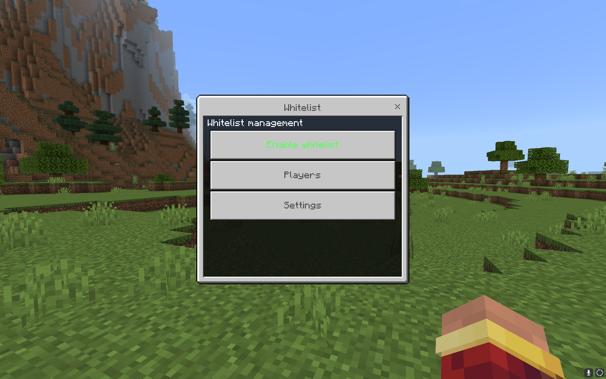
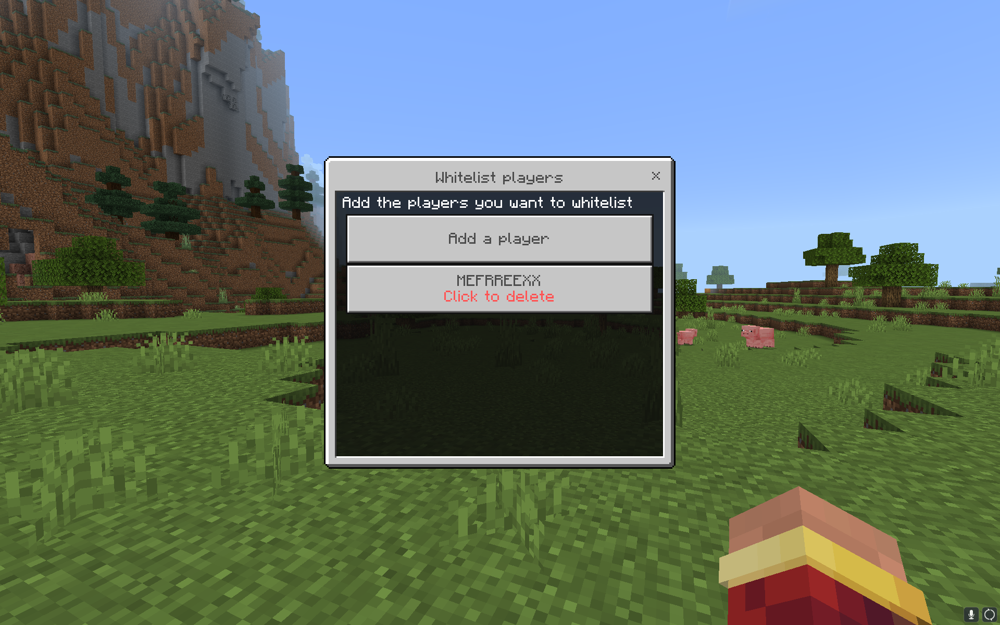
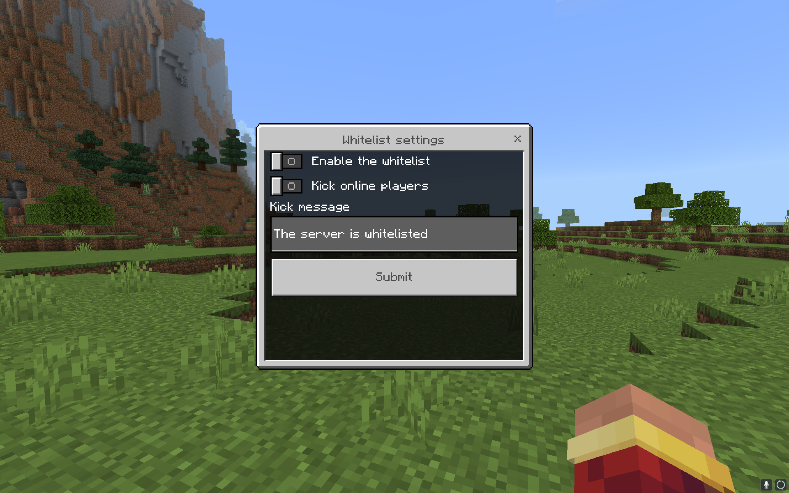

# Whitelister
Продвинутый плагин для белого списка на Nukkit и PowerNukkitX

## 📖 Обзор
**Whitelister** — это продвинутый плагин для белого списка на Nukkit и PowerNukkitX, который предоставляет больше возможностей по сравнению со стандартным белым списком. С Whitelister вы можете легко управлять доступом к своему серверу, настраивать параметры через формы, команды или конфигурационные файлы. Плагин поддерживает несколько языков и различные базы данных.

### ✨ Возможности
- **Удобная настройка**: Управляйте белым списком через формы в игре или команды.
- **Настраиваемые сообщения**: Изменяйте все сообщения плагина в одном конфигурационном файле.
- **Автокик**: Автоматически отключает всех игроков при включении белого списка.
- **Поддержка баз данных**: Выберите между JSON, SQLite3 или MySQL для хранения данных белого списка.
- **Мультиязычность**: Поддерживаются английский, русский и украинский языки.

## 📷 Скриншоты

  
  
  

## 💻 Команды
| Команда        | Описание                              |
|----------------|---------------------------------------|
| `/whitelister` | Открывает главное меню Whitelister.   |

## 🔒 Права доступа
| Право                           | Описание                                                       |
|---------------------------------|----------------------------------------------------------------|
| `whitelister.command.whitelister` | Разрешает игроку использовать команду `/whitelister`.          |
| `whitelister.bypass`            | Позволяет игроку присоединяться к серверу без включения в список.|

## 📋 События
| Название события            | Отменяемое | Описание                                                    |
|-----------------------------|------------|-------------------------------------------------------------|
| `WhitelistKickPlayerEvent`  | Да         | Вызывается, когда игрока выкидывают с сервера при активации белого списка. |

## 🚀 Установка
Чтобы начать использовать Whitelister, выполните следующие шаги:

1. **Скачайте Whitelister**  
   Перейдите на [страницу релизов](https://github.com/MEFRREEX/Whitelister/releases) и загрузите последнюю версию `.jar` файла.
2. **Поместите плагин на сервер**  
   Переместите скачанный `.jar` файл в папку `plugins` вашего сервера.
3. **Установите зависимости**  
   - Скачайте [JOOQConnector](https://github.com/MEFRREEX/JOOQConnector) и поместите его `.jar` файл в папку `plugins`.
   - Скачайте [FormConstructor](https://github.com/MEFRREEX/FormConstructor) и поместите его `.jar` файл в папку `plugins`.
4. **Запустите сервер**  
   Запустите сервер для завершения установки и создания конфигурационных файлов.

---

[Переключиться на английский](README.md)